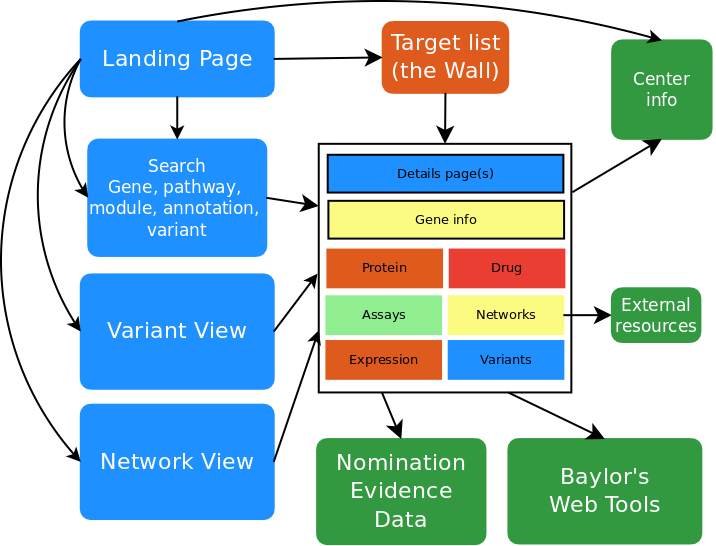
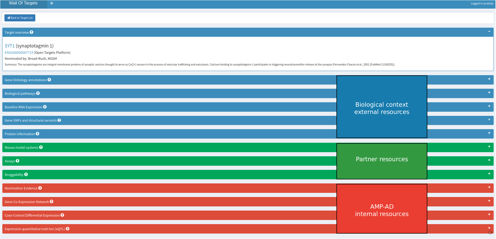
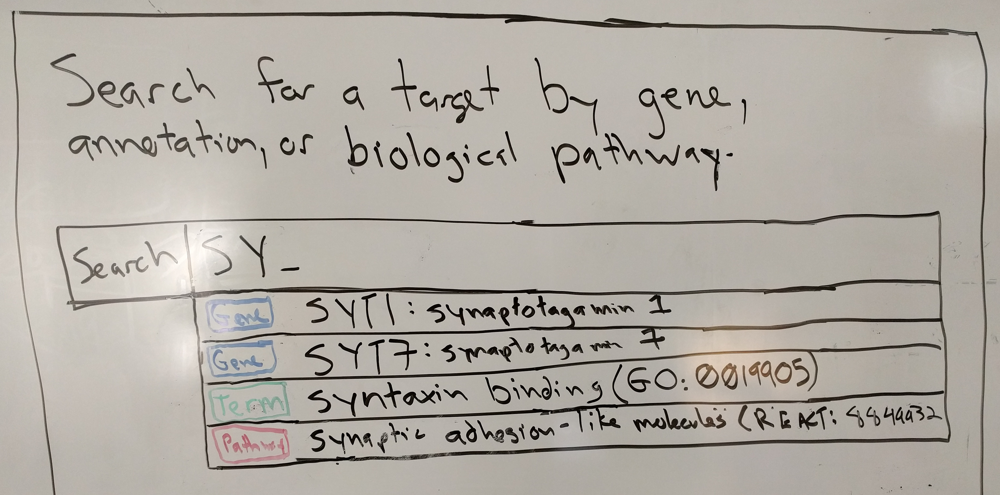
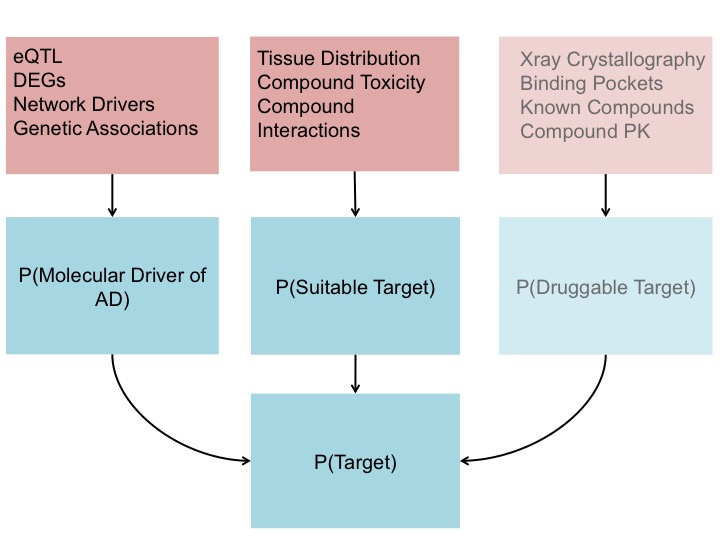
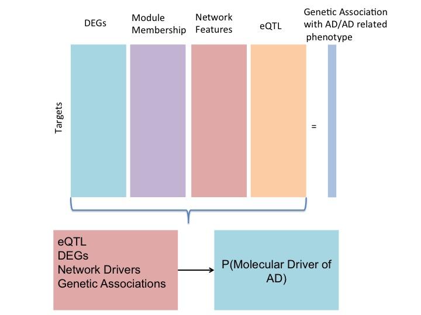
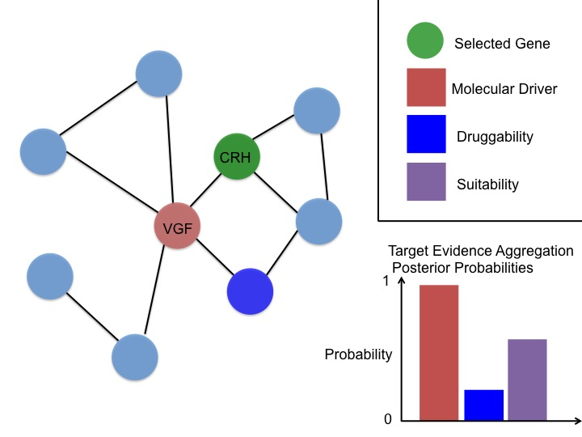

## Goal

Create a visual dashboard and integrative analysis platform that provides consistent and robust supporting evidence for use in:

* Prioritization of targets nominated by individual AMP-AD projects.
* Nomination of targets supported across AMP-AD projects.
* Compilation of AMP-AD evidence for use by research community to evaluate other targets of interest.

## Approach

1. Develop prototype.
1. Build alpha platform based on user feedback, focusing on gene-based
queries for nominated AMP-AD targets.
1. Expand to include genes across the transcriptome (partnership with
Josh Shulman @ Baylor).
1. Expand to provide entry points based on gene, protein, network,
or variant queries.

> **Anticipated users:** AMP-AD consortium and affiliates, MODEL-AD consortium, external AD researchers

## Enhancing AMP-AD Project R01

*Increasing resources for target prioritization within the AMP-AD community*

## User experience interviews

> Understand how our users will interact and utilize the Wall of Targets application - usages, pain points, gaps, and preferences.

> Performed **think aloud exercise** - use the application and state what you are doing and what you are thinking as you use the prototype. 

> 10 participants, including 4 industry/pharma and 3 mouse model system researchers

## Version 0, main page

## Version 0, detail page

## Interviews - what we learned

1. Biological context
1. Nominations and source of evidence
1. Consistency and reproducibility across cohorts
1. Druggability vs. tractability
1. Ranking and comparison

## Overview design

## Main page, alpha version

> Includes overview of evidence for indication of strength of target.

## Details page, alpha version

> Condensed layout including biological context.

## Details page, alpha version

> Indication of data sources.

## Gene Ontology terms, alpha version

## Biological pathways, alpha version

## Mouse models, alpha version

## Baseline RNA Expression, alpha version

> Expression from more sources and outside of brain.

## Search

> Enable for nominated targets (future: whole transcriptome)

## Nomination evidence, alpha version

> Show evidence from nominating center(s)

## Looking forward

- Druggability vs. tractability
- Module-centric search and interaction
- eQTL and genomic variants
- Evidence-based ranking

## Evidence-based ranking

## 

## 

## 

## Thank you

